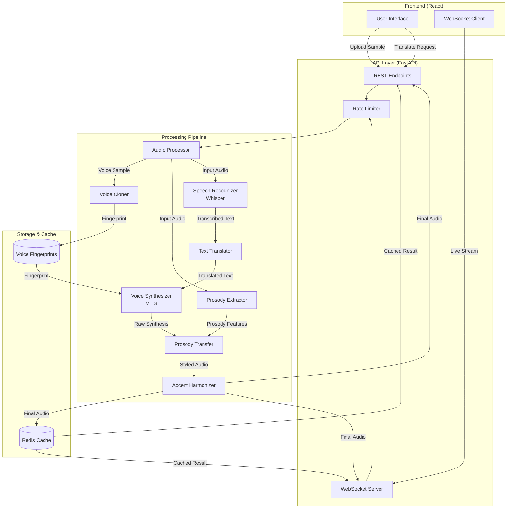

# Design Document: VocalAI

## Overview

VocalAI is a real-time AI-powered translation system that preserves vocal identity and emotional prosody during speech translation. The system architecture follows a pipeline approach with distinct stages for audio processing, speech recognition, translation, voice synthesis, and prosody transfer.

The core innovation lies in separating speech into two parallel streams:
1. **Content Stream**: Audio → Text → Translation → Synthesized Speech
2. **Style Stream**: Audio → Prosody Features → Prosody Transfer → Styled Output

These streams are processed independently and recombined during synthesis to produce translated speech that maintains the speaker's vocal characteristics and emotional delivery.

### Key Design Principles

- **Modularity**: Each component (recognition, translation, synthesis) is independent and replaceable
- **Performance**: Live mode targets <200ms end-to-end latency through streaming and caching
- **Quality**: Voice cloning and prosody transfer maintain perceptual similarity to original speaker
- **Scalability**: Stateless API design with Redis caching for horizontal scaling

## Architecture

### System Architecture Diagram



### Processing Modes

**Batch Mode (REST API)**:
- Complete audio file uploaded
- Full pipeline processing
- Results cached in Redis
- Suitable for pre-recorded content

**Live Mode (WebSocket)**:
- Streaming audio chunks (100-200ms)
- Parallel processing of chunks
- Incremental output delivery
- Optimized for real-time interaction

## Components and Interfaces

### 1. Audio Processor

**Responsibility**: Normalize and prepare audio for downstream processing

**Interface**:
```python
class AudioProcessor:
    def load_audio(file_path: str, format: AudioFormat) -> AudioData
    def normalize_sample_rate(audio: AudioData, target_rate: int = 16000) -> AudioData
    def chunk_audio(audio: AudioData, chunk_size_ms: int = 150) -> Iterator[AudioChunk]
    def validate_format(file_path: str) -> bool
```

**Implementation Notes**:
- Uses librosa for audio loading and resampling
- Supports WAV, MP3, FLAC, OGG formats
- Normalizes all audio to 16kHz mono for consistency
- Chunk size of 150ms balances latency and processing efficiency

### 2. Voice Cloner

**Responsibility**: Create and manage vocal fingerprints from speaker samples

**Interface**:
```python
class VoiceCloner:
    def create_fingerprint(audio: AudioData, speaker_id: str) -> VoiceFingerprint
    def validate_sample_length(audio: AudioData) -> ValidationResult
    def store_fingerprint(fingerprint: VoiceFingerprint, speaker_id: str) -> bool
    def load_fingerprint(speaker_id: str) -> Optional[VoiceFingerprint]
```

**Implementation Notes**:
- Requires 5-30 seconds of clean speech
- Extracts speaker embeddings using pre-trained speaker encoder
- Fingerprints stored as 256-dimensional vectors
- Uses cosine similarity for speaker verification

### 3. Prosody Extractor

**Responsibility**: Extract pitch, energy, and timing features from speech

**Interface**:
```python
class ProsodyExtractor:
    def extract_features(audio: AudioData) -> ProsodyFeatures
    def get_pitch_contour(audio: AudioData) -> np.ndarray
    def get_energy_envelope(audio: AudioData) -> np.ndarray
    def get_duration_features(audio: AudioData, phonemes: List[str]) -> np.ndarray
```

**Data Structures**:
```python
@dataclass
class ProsodyFeatures:
    pitch_contour: np.ndarray      # F0 values over time
    energy_envelope: np.ndarray    # RMS energy over time
    duration_ratios: np.ndarray    # Phoneme duration ratios
    frame_rate: int                # Features per second
```

**Implementation Notes**:
- Uses CREPE or YAAPT for pitch extraction
- Extracts features at 100 frames per second
- Normalizes features for speaker-independent representation

### 4. Speech Recognizer

**Responsibility**: Convert speech to text using OpenAI Whisper

**Interface**:
```python
class SpeechRecognizer:
    def transcribe(audio: AudioData, source_language: str) -> TranscriptionResult
    def transcribe_streaming(audio_stream: Iterator[AudioChunk]) -> Iterator[TranscriptionChunk]
    def get_confidence_scores(result: TranscriptionResult) -> List[float]
```

**Data Structures**:
```python
@dataclass
class TranscriptionResult:
    text: str
    language: str
    confidence: float
    word_timestamps: List[Tuple[str, float, float]]  # (word, start, end)
```

**Implementation Notes**:
- Uses Whisper medium or large model based on accuracy requirements
- Supports streaming mode with 30-second context window
- Returns word-level timestamps for prosody alignment

### 5. Text Translator

**Responsibility**: Translate text between languages

**Interface**:
```python
class TextTranslator:
    def translate(text: str, source_lang: str, target_lang: str) -> TranslationResult
    def detect_language(text: str) -> str
    def get_supported_languages() -> List[str]
```

**Implementation Notes**:
- Uses pre-trained translation models (e.g., MarianMT, NLLB)
- Supports English, Spanish, Hindi, Mandarin, French, German
- Preserves sentence structure for prosody alignment

### 6. Voice Synthesizer

**Responsibility**: Generate speech using VITS with voice cloning

**Interface**:
```python
class VoiceSynthesizer:
    def synthesize(text: str, fingerprint: VoiceFingerprint, language: str) -> AudioData
    def synthesize_with_prosody(text: str, fingerprint: VoiceFingerprint, 
                                prosody: ProsodyFeatures) -> AudioData
    def get_phoneme_durations(text: str, language: str) -> List[float]
```

**Implementation Notes**:
- Uses VITS (Variational Inference with adversarial learning for end-to-end Text-to-Speech)
- Conditions synthesis on speaker embeddings from voice fingerprint
- Generates 22.05kHz audio, upsampled to match input if needed
- Supports multi-speaker VITS models for better voice cloning

### 7. Prosody Transfer Engine

**Responsibility**: Apply original prosody to synthesized speech

**Interface**:
```python
class ProsodyTransferEngine:
    def transfer_prosody(synthesized_audio: AudioData, 
                        target_prosody: ProsodyFeatures) -> AudioData
    def align_prosody(source_features: ProsodyFeatures, 
                     target_phonemes: List[str]) -> ProsodyFeatures
    def interpolate_features(features: ProsodyFeatures, 
                           target_length: int) -> ProsodyFeatures
```

**Implementation Notes**:
- Uses PSOLA (Pitch Synchronous Overlap and Add) for pitch modification
- Applies time-stretching for duration matching
- Uses dynamic time warping (DTW) for feature alignment
- Preserves naturalness through smooth interpolation

### 8. Accent Harmonizer

**Responsibility**: Blend original accent with target language phonetics

**Interface**:
```python
class AccentHarmonizer:
    def harmonize(audio: AudioData, accent_level: float, 
                 source_lang: str, target_lang: str) -> AudioData
    def extract_accent_features(audio: AudioData, language: str) -> AccentFeatures
    def blend_phonetics(audio: AudioData, accent_features: AccentFeatures, 
                       blend_ratio: float) -> AudioData
```

**Implementation Notes**:
- accent_level ranges from 0.0 (neutral) to 1.0 (full original accent)
- Modifies formant frequencies to adjust accent characteristics
- Uses language-specific phonetic models for target pronunciation
- Applies weighted blending of source and target phonetic features

### 9. Cache Manager

**Responsibility**: Manage Redis caching for performance optimization

**Interface**:
```python
class CacheManager:
    def get_cached_translation(audio_hash: str) -> Optional[AudioData]
    def cache_translation(audio_hash: str, result: AudioData, ttl: int = 3600) -> bool
    def compute_audio_hash(audio: AudioData) -> str
    def invalidate_cache(pattern: str) -> int
```

**Implementation Notes**:
- Uses SHA-256 hash of audio content as cache key
- Stores compressed audio (MP3) to reduce memory usage
- Default TTL of 1 hour, configurable per request
- Implements LRU eviction policy

### 10. API Layer

**REST Endpoints**:

```python
# Voice fingerprint creation
POST /api/v1/voice/fingerprint
Request: multipart/form-data (audio file, speaker_id)
Response: {fingerprint_id: str, status: str}

# Batch translation
POST /api/v1/translate
Request: {
    audio: base64 | file,
    speaker_id: str,
    source_lang: str,
    target_lang: str,
    accent_level: float
}
Response: {
    translated_audio: base64,
    transcription: str,
    translation: str,
    processing_time_ms: int
}

# Health check
GET /api/v1/health
Response: {status: str, components: dict}
```

**WebSocket Endpoint**:

```python
# Live translation stream
WS /api/v1/translate/live
Client → Server: {
    type: "config",
    speaker_id: str,
    source_lang: str,
    target_lang: str,
    accent_level: float
}
Client → Server: {
    type: "audio_chunk",
    data: base64,
    sequence: int
}
Server → Client: {
    type: "translation_chunk",
    audio: base64,
    sequence: int,
    latency_ms: int
}
```

## Data Models

### VoiceFingerprint

```python
@dataclass
class VoiceFingerprint:
    speaker_id: str
    embedding: np.ndarray          # 256-dimensional speaker embedding
    sample_rate: int
    created_at: datetime
    metadata: Dict[str, Any]       # Language, gender, age range, etc.
```

### ProsodyFeatures

```python
@dataclass
class ProsodyFeatures:
    pitch_contour: np.ndarray      # F0 values (Hz) over time
    energy_envelope: np.ndarray    # RMS energy (dB) over time
    duration_ratios: np.ndarray    # Phoneme duration ratios
    frame_rate: int                # Features per second (typically 100)
    voiced_mask: np.ndarray        # Boolean mask for voiced frames
```

### TranslationRequest

```python
@dataclass
class TranslationRequest:
    audio_data: AudioData
    speaker_id: str
    source_language: str
    target_language: str
    accent_level: float            # 0.0 to 1.0
    use_cache: bool = True
    live_mode: bool = False
```

### TranslationResult

```python
@dataclass
class TranslationResult:
    translated_audio: AudioData
    original_transcription: str
    translated_text: str
    processing_time_ms: int
    latency_breakdown: Dict[str, int]  # Per-component timing
    cache_hit: bool
```

## Correctness Properties

*A property is a characteristic or behavior that should hold true across all valid executions of a system—essentially, a formal statement about what the system should do. Properties serve as the bridge between human-readable specifications and machine-verifiable correctness guarantees.*


### Property Reflection

After analyzing all acceptance criteria, I've identified several areas where properties can be consolidated:

**Consolidations:**
- Properties 1.1, 1.2, 1.3 (voice sample length validation) can be combined into a single property about sample length handling
- Properties 3.1, 3.2, 3.3 (speech recognition) can be combined into a comprehensive transcription property
- Properties 4.1, 4.2 (text translation) can be combined into a single translation property
- Properties 11.1, 11.2, 11.3, 11.4 (audio format support) can be combined into a comprehensive format handling property
- Properties 9.1, 9.2, 9.3 (API endpoints) are concrete examples, not properties - will be tested as examples
- Properties 12.1, 12.2, 12.3, 12.5 (UI elements) are concrete examples - will be tested as examples

**Unique Properties Retained:**
- Voice fingerprint storage round-trip (1.4)
- Prosody extraction completeness (2.1)
- Prosody transfer application (2.2, 2.3 combined)
- Voice synthesis with cloning (5.1, 5.2 combined)
- Live mode latency (6.1)
- Accent harmonization blending (7.1, 7.2 combined)
- Cache round-trip (8.1, 8.2 combined)
- Cache expiration (8.3)
- API error handling (9.4)
- Rate limiting (9.5)
- Error response structure (10.1, 10.2, 10.3 combined)
- UI progress indicators (12.4)

### Correctness Properties

**Property 1: Voice Sample Length Validation**

*For any* audio sample provided to the Voice_Cloner, if the sample is between 5 and 30 seconds (inclusive), a vocal fingerprint should be created; if less than 5 seconds, an error should be returned; if greater than 30 seconds, only the first 30 seconds should be used for fingerprint creation.

**Validates: Requirements 1.1, 1.2, 1.3**

**Property 2: Voice Fingerprint Storage Round-Trip**

*For any* vocal fingerprint created and stored with a speaker_id, retrieving the fingerprint using the same speaker_id should return an equivalent fingerprint.

**Validates: Requirements 1.4**

**Property 3: Audio Format Support**

*For any* audio file in WAV, MP3, FLAC, or OGG format, the Audio_Processor should successfully load and process it; for any unsupported format, an error should be returned indicating supported formats.

**Validates: Requirements 1.5, 11.1, 11.2**

**Property 4: Sample Rate Normalization**

*For any* audio input with any sample rate, the Audio_Processor should normalize it to the target sample rate (16kHz) without data loss.

**Validates: Requirements 11.3**

**Property 5: Output Format Preservation**

*For any* audio input in a specific format, the output translated audio should be in the same format unless a different format is explicitly specified.

**Validates: Requirements 11.4**

**Property 6: Prosody Feature Extraction Completeness**

*For any* input audio, the Prosody_Extractor should extract all required features: pitch contours, energy patterns, and timing information, with none missing.

**Validates: Requirements 2.1**

**Property 7: Prosody Transfer Application**

*For any* synthesized audio and extracted prosody features, applying prosody transfer should result in output audio where the prosody characteristics (pitch, energy, timing) are measurably similar to the original within defined tolerance thresholds.

**Validates: Requirements 2.2, 2.3**

**Property 8: Speech Recognition with Confidence**

*For any* audio input in a supported language (English, Spanish, Hindi, Mandarin, French, German), the Speech_Recognizer should produce a transcription with confidence scores for the transcribed text.

**Validates: Requirements 3.1, 3.2, 3.3**

**Property 9: Text Translation Across Language Pairs**

*For any* text in a source language and a target language (both from the supported set), the Text_Translator should produce a translated text in the target language.

**Validates: Requirements 4.1, 4.2**

**Property 10: Voice Synthesis with Cloning**

*For any* translated text and vocal fingerprint, the Voice_Synthesizer should generate speech audio that incorporates the vocal fingerprint's characteristics.

**Validates: Requirements 5.1, 5.2**

**Property 11: Live Mode Latency Constraint**

*For any* audio chunk processed in live mode, the end-to-end latency from input to translated output should be below 200 milliseconds.

**Validates: Requirements 6.1**

**Property 12: Accent Harmonization Blending**

*For any* accent level value between 0 and 100, the Accent_Harmonizer should produce audio where accent characteristics are blended proportionally (0 = neutral target language accent, 100 = maximum original accent preservation).

**Validates: Requirements 7.1, 7.2**

**Property 13: Translation Caching Round-Trip**

*For any* completed translation, storing it in cache with its audio hash as key and then retrieving it with the same hash should return the same translated audio; processing identical input audio twice should result in a cache hit on the second request.

**Validates: Requirements 8.1, 8.2**

**Property 14: Cache Expiration**

*For any* cached translation with a specified TTL, attempting to retrieve it after the TTL has elapsed should result in a cache miss.

**Validates: Requirements 8.3**

**Property 15: API Error Response Structure**

*For any* malformed API request, the system should return an HTTP error response with an appropriate status code and a structured error message containing error code and description.

**Validates: Requirements 9.4**

**Property 16: Rate Limiting Enforcement**

*For any* client making requests at a rate exceeding the configured limit, subsequent requests should be rejected with a 429 (Too Many Requests) status code.

**Validates: Requirements 9.5**

**Property 17: Error Response Completeness**

*For any* component failure during processing, the system should return a structured error response containing: error code, description, timestamp, component name, and diagnostic information.

**Validates: Requirements 10.1, 10.2, 10.3**

**Property 18: UI Progress Indication**

*For any* translation request in progress, the UI should display progress indicators that update as processing advances through pipeline stages.

**Validates: Requirements 12.4**

## Error Handling

### Error Categories

**1. Input Validation Errors**
- Invalid audio format
- Audio sample too short/long
- Unsupported language
- Invalid accent level value
- Malformed API requests

**Response**: HTTP 400 Bad Request with structured error message

**2. Processing Errors**
- Speech recognition failure
- Translation service unavailable
- Voice synthesis failure
- Prosody extraction failure

**Response**: HTTP 500 Internal Server Error with component identification

**3. Resource Errors**
- Voice fingerprint not found
- Cache unavailable
- Storage failure

**Response**: HTTP 404 Not Found or HTTP 503 Service Unavailable

**4. Performance Errors**
- Latency threshold exceeded
- Timeout during processing

**Response**: HTTP 504 Gateway Timeout with latency breakdown

### Error Response Format

```python
@dataclass
class ErrorResponse:
    error_code: str              # e.g., "INVALID_AUDIO_FORMAT"
    message: str                 # Human-readable description
    component: str               # Component that failed
    timestamp: datetime
    request_id: str             # For tracing
    details: Dict[str, Any]     # Additional diagnostic info
```

### Graceful Degradation

- **Prosody extraction failure**: Continue with neutral prosody
- **Cache unavailable**: Process without caching
- **Low confidence transcription**: Flag segments but continue
- **Partial synthesis failure**: Return partial results with warning

### Logging Strategy

- **ERROR level**: Component failures, processing errors
- **WARN level**: Performance degradation, low confidence, cache misses
- **INFO level**: Request processing, cache hits, successful completions
- **DEBUG level**: Detailed timing, feature values, intermediate results

All logs include:
- Request ID for tracing
- Component name
- Timestamp
- Latency measurements

## Testing Strategy

### Dual Testing Approach

VocalAI requires both unit testing and property-based testing for comprehensive coverage:

**Unit Tests**: Focus on specific examples, edge cases, and integration points
- Specific audio samples with known characteristics
- Edge cases (minimum/maximum sample lengths, boundary accent values)
- Error conditions (malformed inputs, service failures)
- Integration between components

**Property-Based Tests**: Verify universal properties across all inputs
- Generate random audio samples, text, and parameters
- Verify properties hold for all generated inputs
- Minimum 100 iterations per property test
- Catch edge cases that manual testing might miss

### Property-Based Testing Configuration

**Framework**: Use `hypothesis` for Python components

**Test Configuration**:
- Minimum 100 iterations per property test
- Each test tagged with: `Feature: vocalai, Property {N}: {property_text}`
- Custom generators for:
  - Audio samples (various lengths, sample rates, formats)
  - Voice fingerprints
  - Prosody features
  - Language pairs
  - Accent levels (0-100)

**Example Property Test Structure**:

```python
from hypothesis import given, strategies as st
import pytest

@given(
    audio_length=st.floats(min_value=5.0, max_value=30.0),
    sample_rate=st.integers(min_value=8000, max_value=48000)
)
@pytest.mark.property_test
def test_voice_sample_length_validation(audio_length, sample_rate):
    """
    Feature: vocalai, Property 1: Voice Sample Length Validation
    For any audio sample between 5-30 seconds, fingerprint should be created
    """
    audio = generate_audio(length=audio_length, sample_rate=sample_rate)
    result = voice_cloner.create_fingerprint(audio, "test_speaker")
    assert result.fingerprint is not None
    assert result.status == "success"
```

### Test Coverage Requirements

**Unit Tests**:
- Component-level tests for each class
- Integration tests for pipeline flows
- API endpoint tests (REST and WebSocket)
- Error handling scenarios
- UI component tests (React Testing Library)

**Property Tests** (one per correctness property):
1. Voice sample length validation
2. Voice fingerprint storage round-trip
3. Audio format support
4. Sample rate normalization
5. Output format preservation
6. Prosody feature extraction completeness
7. Prosody transfer application
8. Speech recognition with confidence
9. Text translation across language pairs
10. Voice synthesis with cloning
11. Live mode latency constraint
12. Accent harmonization blending
13. Translation caching round-trip
14. Cache expiration
15. API error response structure
16. Rate limiting enforcement
17. Error response completeness
18. UI progress indication

### Performance Testing

- **Latency benchmarks**: Measure end-to-end latency for various audio lengths
- **Load testing**: Test system under concurrent requests
- **Cache effectiveness**: Measure cache hit rates and performance improvement
- **Memory profiling**: Monitor memory usage during live mode streaming

### Integration Testing

- **End-to-end flows**: Complete translation pipeline from audio input to output
- **WebSocket streaming**: Test live mode with simulated audio streams
- **Error recovery**: Test graceful degradation scenarios
- **Multi-language**: Test all supported language pairs

### Acceptance Testing

- **Voice similarity**: Perceptual evaluation of voice cloning quality
- **Prosody preservation**: Human evaluation of emotional delivery
- **Translation quality**: Semantic accuracy assessment
- **Latency perception**: User experience testing for live mode
